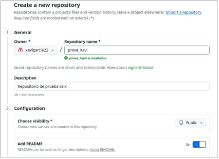
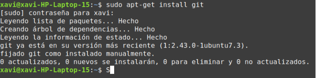
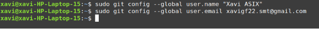
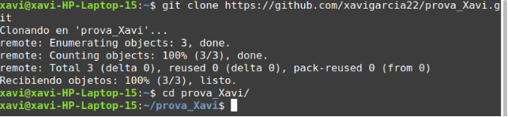
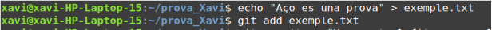
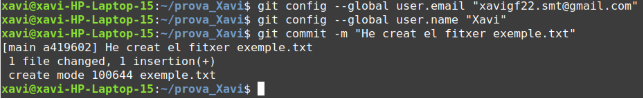

**Ejercicio 1: Introducción a git y GitHub**

**IAW**

Xavi Garcia Ferrando 2 ASIX

4 ASIX/IAW

2. Crea a GitHub un repositori amb el nom prova\_el\_teu\_nom (inicialitza el repositori amb un fitxer README) i la descripció Repositorio de prueba 2ASIX.

3. Instal·la git en el teu ordinador (si no el tens instalado!!!)

4. Configuració de git. El primer que hauries de fer quan instal·les Git és establir el teu nom dusuari i adreça de correu electrònic (Assegura’t que les dades són correctes i que has posat el teu nom complet). Això és important perquè les confirmacions de canvis (commits) a Git utilitzen aquesta informació, i és introduïda de manera immutable en els commits que envieu.

Clonem el repositori remot.

Crearem un nou fitxer, l’afegirem al nostre repositori local i després ho sincronitzarem amb el nostre repositori remot de GitHub. Cada vegada que fem una modificació en un fitxer ho podem assenyalar creant un commit. Els missatges dels commits són fonamentals per explicar l’evolució d’un projecte. Un commit ha de ser un petit conjunt de canvis dels fitxers del projecte amb una certa coherència.

Si modifiqueu un fitxer al vostre repositori local, no l’heu de tornar a afegir al vostre repositori (git add). Però has de fer servir l’opció -a en fer el commit.
Xavi Garcia Ferrando                                                                                                             4 
