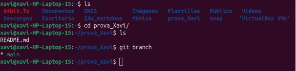
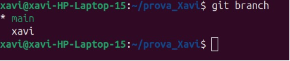
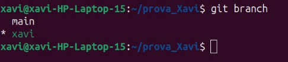
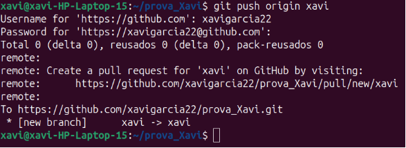
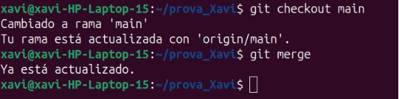
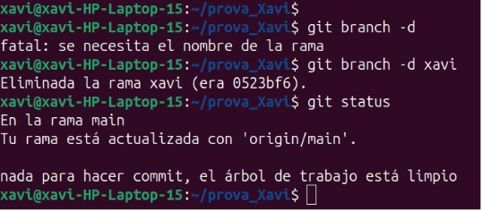

**Pràctica 1: GIT – branques i unions**

**IAW**

Xavi Garcia Ferrando 2 ASIX/IAW

4 ASIX/IAW

- Llistar branques locals:

- Crear una nova branca:

- Fer un push per crear-les en remot.

- Per unir una branca a la principal, executem:

- És prou freqüent crear una branca, fer els canvis que siguen necessaris, unir-la a una branca principal i després eliminar la branca que s’havia creat. 

Xavi Garcia Ferrando                                                                                                                                         4
