**Pràctica 2: Col·laborant - pull request (PR)**

**IAW**

Xavi Garcia Ferrando 2 ASIX

6 ASIX/IAW

- Fer un fork del repositori.

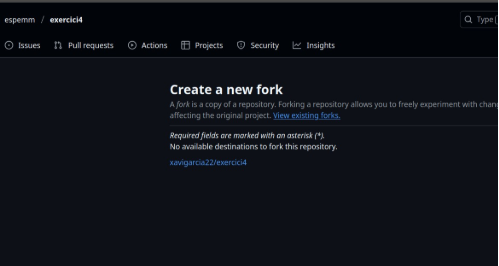

- Clonar localment el fork creat.

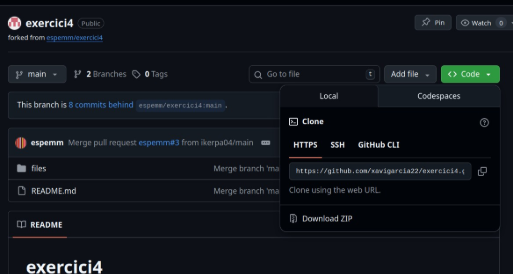

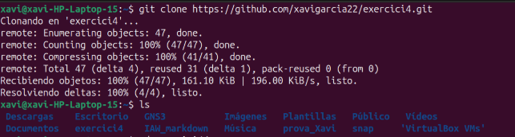

- Crear una branca.

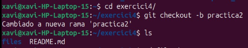

- Modificar fitxer README i afegir un enllaç dins de directori files.

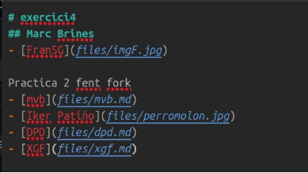

- Crear fitxer amb les inicials del alumne i afegir contingut en markdown.

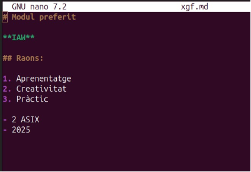

- Afegir, commitejar i pujar al repositori.

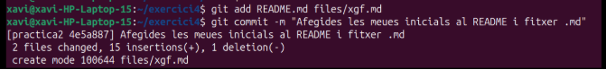

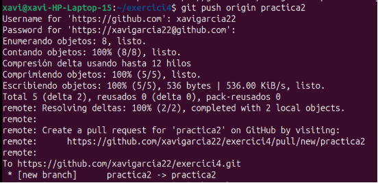

- Crear el pull request, accedint al git 

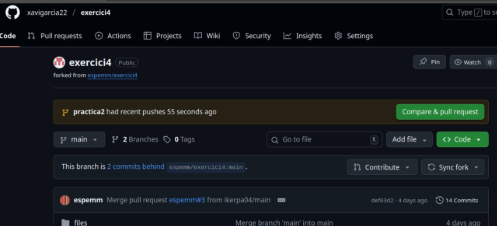

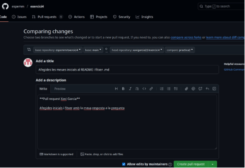

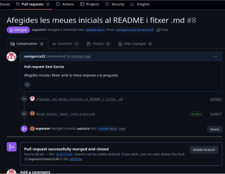
Xavi Garcia Ferrando                                                                                                                                         6
