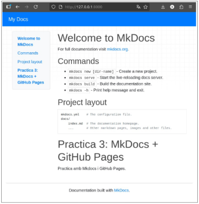

**Mkdocs + Github Pages**

**IAW**

Xavi Garcia Ferrando 2 ASIX

6 ASIX/IAW

- Instal·lem mkdocs i el tema material.

*sudo apt install mkdocs*

*sudo apt install mkdocs-material*

- Creem el nou projecte. 

- Editem el fitxer docs/index.md i afegim contingut en markdown.

- Provem la web local executant mkdocs serve estaguent en /practica3.

Al navegaor introduïm :

- Generem la web estàtica. Es creara la carpeta site/ amb els fitxers HTML.

- A la pàgina de git, creem un nou repositori amb el nom de la pràctica i desde la la terminal inicialitzem git i ho pugem.

- Despleguem a GitHub pages. Això crea la branca gh-pages automàticament al repositori.

- Activar GitHub pages a GitHub. Accedim a Git, Settings>Pages.

Podem observar que la web esta disponible al enllaç https. Seleccionem el enllaç i observem el contingut de la pàgina MkDocs.

Xavi Garcia Ferrando                                                                                                                                    6
