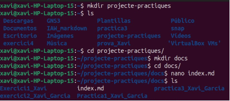
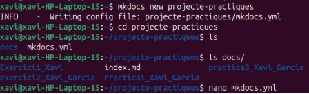
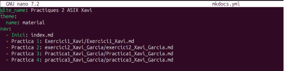
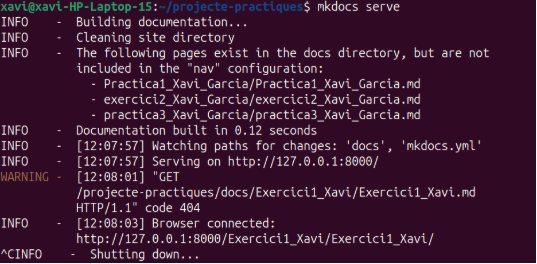
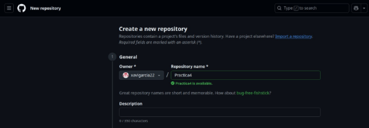
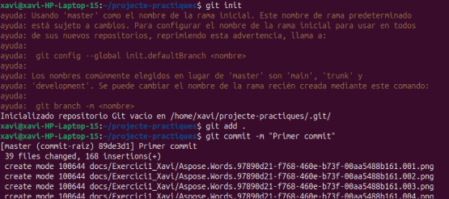
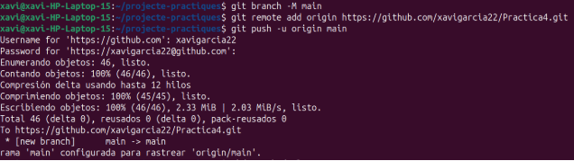
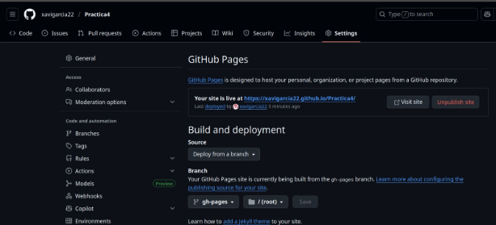
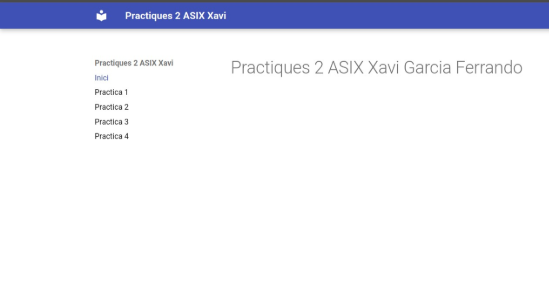

**Práctica 4: Desplegament en Github Pages**

**IAW**

Xavi Garcia Ferrando 2 ASIX

6 ASIX/IAW

El primer que hem de fer es passar totes les nostres practiques a markdown, utilitzant pagines com [conversor_md.](https://products.aspose.app/words/es/conversion/pdf-to-md)

Despres creem la estructura per als fitxers:

Una vegada fet, inicialitzem el projecte en mkdocs amb el mateix nom de la estructura, mkdocs detectara la estructura creada i la implantara.

Editem el fitxer index.md per a crear el nostre index del projecte y després el mkdocs.yaml amb les rutes fins a les nostres pràctiques.

Per a comprobar que es veu correctament, executem:

Després obri al navegador *htt[*p://127.0.0.1:8000*](http://127.0.0.1:8000/)*

El següent pas sera desplegar en GitHub Pages. Creem un nou repositori: 

Afegim Git i pugem el projecte.

Finalment, entrem a gitbub en settings>pages i publiquem la pàgina on vorem que crea un enllaç.

Si accedim al enllaç podem vore el contingut.

Xavi Garcia Ferrando                                                                                                                                     6
